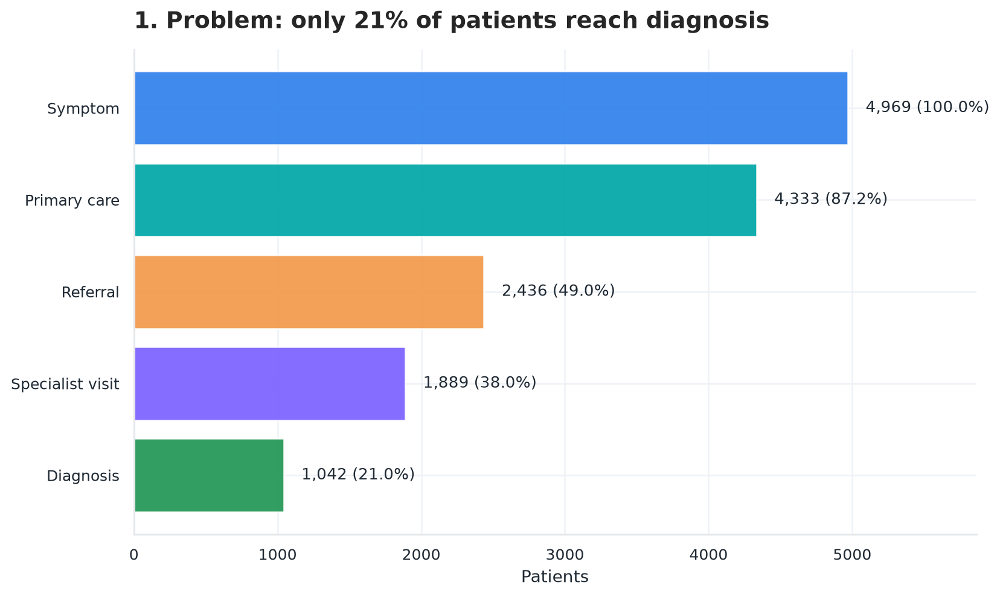
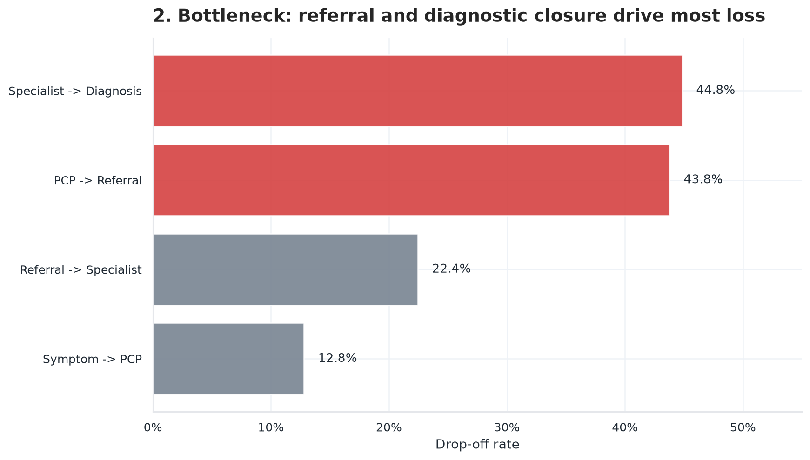
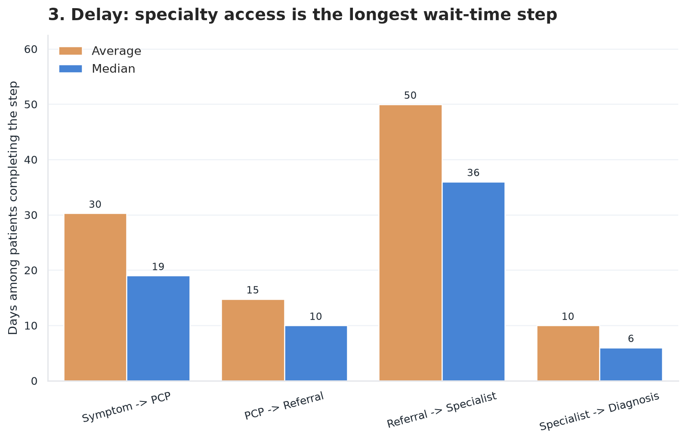
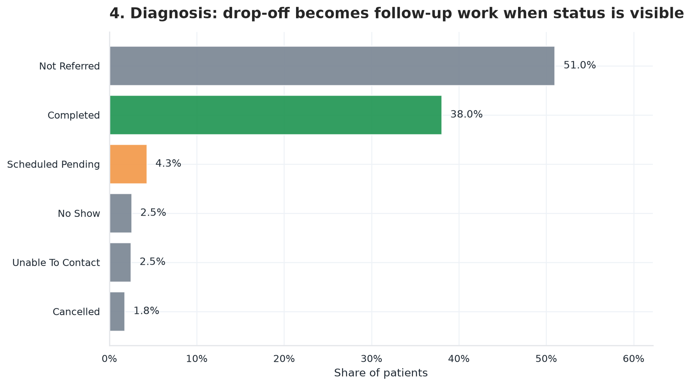
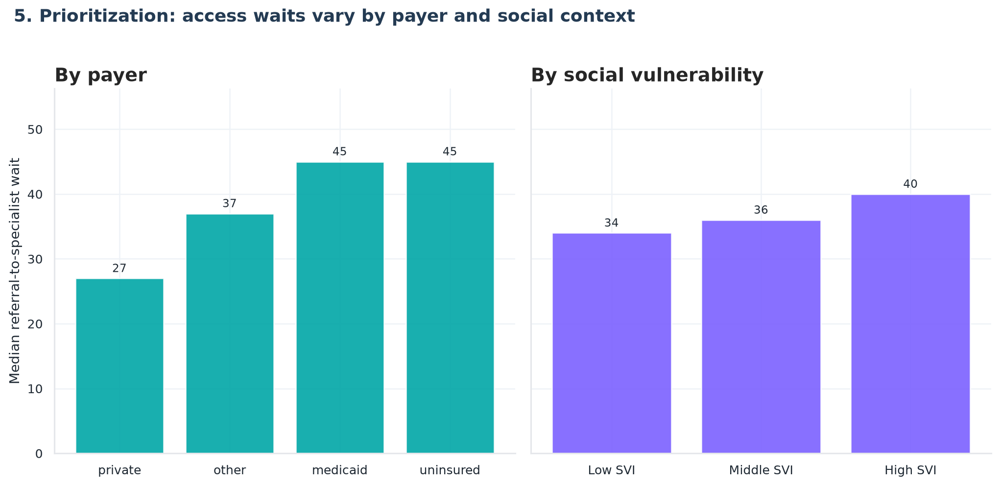
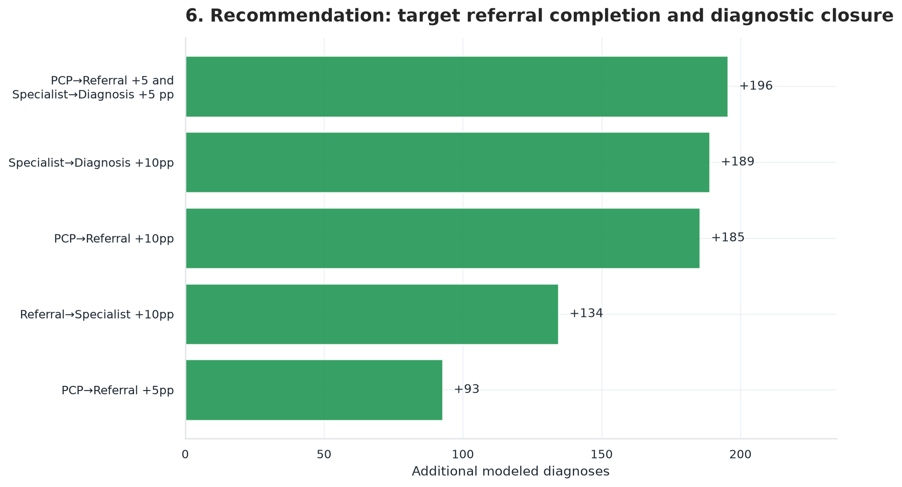
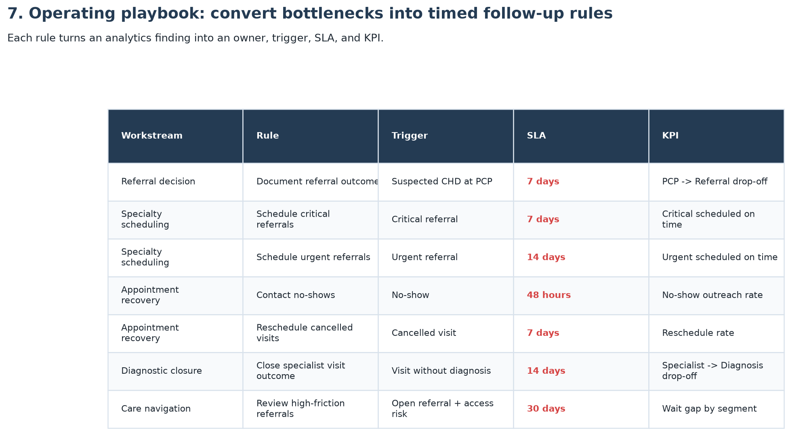

# Pediatric CHD Care Pathway Analytics

Healthcare operations analytics project using **Python, SQL, Excel-ready exports, and Power BI-ready tables** to study where children may be delayed or lost before a congenital heart disease (CHD) diagnosis.

All data is synthetic. The goal is to demonstrate an end-to-end analytics workflow that resembles real healthcare operations work without using protected patient records.

## Business Question

Where do patients fall out of the diagnostic pathway, how long do they wait at each step, and which operational fixes could improve diagnosis completion?

The modeled pathway is:

```text
Symptom documented -> Primary care -> Referral -> Specialist visit -> Diagnosis
```

## Executive Snapshot

| Metric | Current result |
|---|---:|
| Synthetic patient cohort | 4,969 |
| Reached primary care | 4,333 |
| Received referral | 2,436 |
| Completed specialist visit | 1,889 |
| Received diagnosis | 1,042 |
| Overall diagnosis completion | 21.0% |
| Largest drop-off | Specialist -> Diagnosis, 44.8% |
| Second-largest drop-off | PCP -> Referral, 43.8% |
| Longest median wait | Referral -> Specialist, 36 days |

## Why The Data Is Realistic Enough For A Portfolio Project

The dataset is synthetic, but it is shaped to mimic common healthcare data patterns:

- Stage drop-off is sequential: patients cannot receive a diagnosis without completing the prior documented pathway stages.
- Wait times are right-skewed, which is common in healthcare access data.
- Complex CHD types reach care faster than mild/incidental defects.
- Medicaid, uninsured, high-SVI, and longer-distance patients tend to wait longer for specialty access.
- Later pathway fields contain expected nulls because many patients do not reach those stages.
- Business-readable operational fields are included for BI work: referral priority, authorization status, appointment status, region, capacity tier, and distance to specialist.

This means the analysis is useful for demonstrating workflow thinking, metric design, data quality checks, and BI storytelling. It should not be interpreted as real clinical evidence.

## Key Findings

1. **Most patients do not reach diagnosis in the documented pathway.**  
   Only 1,042 of 4,969 patients have a recorded diagnosis, a completion rate of about 21%.

2. **The main issue is pathway coordination, not one isolated segment.**  
   The largest losses happen at PCP -> Referral and Specialist -> Diagnosis.

3. **Specialty access is the longest wait-time bottleneck.**  
   Referral -> Specialist has the longest median wait among completed stages.

4. **Operational context matters.**  
   Payer type, social vulnerability, distance, appointment status, and authorization status create realistic business questions for deeper analysis.

5. **Scenario modeling helps size improvement opportunities.**  
   Improving PCP -> Referral and Specialist -> Diagnosis conversion by 5 percentage points each models about 196 additional diagnoses in the synthetic cohort.

## Tools Used

| Layer | Tools |
|---|---|
| Data generation and cleaning | Python, pandas, numpy |
| Analysis | SQL, SQLite, Python |
| Data quality | pytest, custom QC report |
| Business reporting | Excel-ready CSVs, Power BI-ready tables |
| Dashboarding | Power BI-ready outputs, Streamlit optional |
| Scenario modeling | Python sequential funnel model |

## Project Structure

```text
data/raw/                         source-style synthetic EHR tables
data/marts/cleaned/               patient-level analytical mart
scripts/                          data generation, QA, analytics, exports
sql/                              SQL analysis pack
sql/results/                      regenerated SQL outputs
outputs/analytics/                technical analytics outputs
outputs/business_ready/           plain-language CSVs
outputs/bi_ready/                 Power BI-ready fact/summary tables
app/streamlit_app.py              optional technical dashboard
tests/                            pytest validation suite
```

## Main Outputs

- `outputs/bi_ready/patient_pathway_detail.csv`  
  Patient-level table for Power BI with plain-language flags and operational context.

- `outputs/analytics/coordination_failure_scorecard.csv`  
  Stage-level scorecard combining conversion, drop-off, average wait, and median wait.

- `outputs/business_ready/stage_leakage_and_waits.csv`  
  Business-friendly version of the bottleneck table.

- `outputs/analytics/recommendations_counterfactuals.csv`  
  Scenario estimates for conversion improvements.

- `outputs/analytics/QC_Report.csv`  
  Data quality checks for nulls, duplicates, date sequence, interval outliers, and alignment.

## Visual Story

All charts are in `outputs/charts/portfolio/`.

### 1. Pathway Funnel — only 21% reach diagnosis


### 2. Stage Drop-off — referral and diagnostic closure are the two biggest losses


### 3. Wait Time Bottleneck — specialty access takes the longest


### 4. Operational Status Mix — what's actually happening to patients who don't progress


### 5. Access Segments — payer type and social vulnerability drive specialty wait gaps


### 6. Scenario Impact — which improvements move the needle most


### 7. Operating Rules Roadmap — recommendations with triggers, SLAs, and KPIs


For the full business action plan, see [`docs/KEY_RECOMMENDATIONS.md`](docs/KEY_RECOMMENDATIONS.md).

## How To Run

```bash
pip install -r requirements.txt

python scripts/regenerate_realistic_data.py
python scripts/build_core_analytics_outputs.py
python scripts/compute_counterfactuals.py
python scripts/sensitivity_counterfactuals.py
python scripts/build_coordination_scorecard.py
python scripts/data_quality_checks.py
python scripts/trend_analysis.py
python scripts/advanced_segmentation.py
python scripts/root_cause_analysis.py
python scripts/create_business_friendly_exports.py
python scripts/run_sql_queries.py
pytest
```

## Docs

- [`docs/KEY_RECOMMENDATIONS.md`](docs/KEY_RECOMMENDATIONS.md) — operating rules with triggers, owners, SLAs, and KPIs
- [`docs/DATA_DICTIONARY.md`](docs/DATA_DICTIONARY.md) — field definitions for the dataset

## Resume Positioning

Built an end-to-end healthcare operations analytics project using Python, SQL, Excel-ready reporting, and Power BI-ready data outputs to analyze pediatric CHD diagnostic pathway leakage across 4,969 synthetic EHR-style patient records. Created a