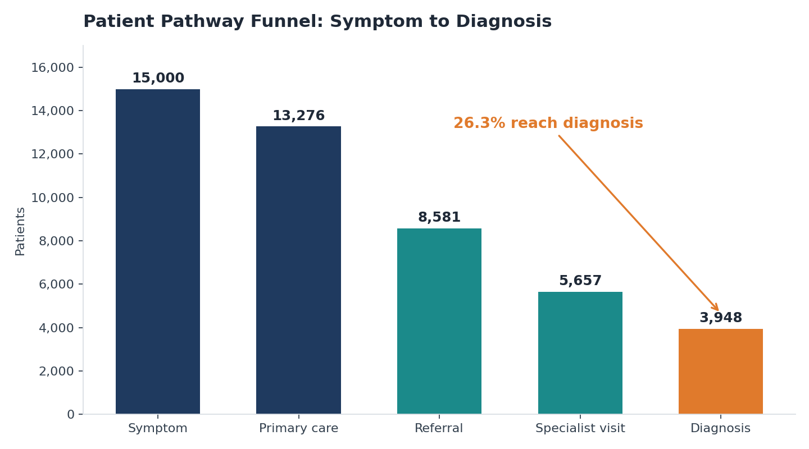
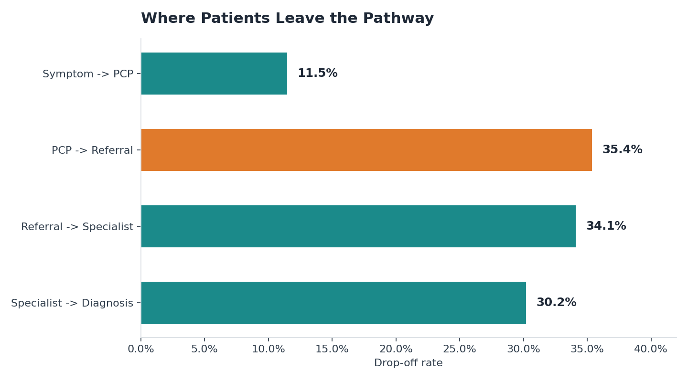
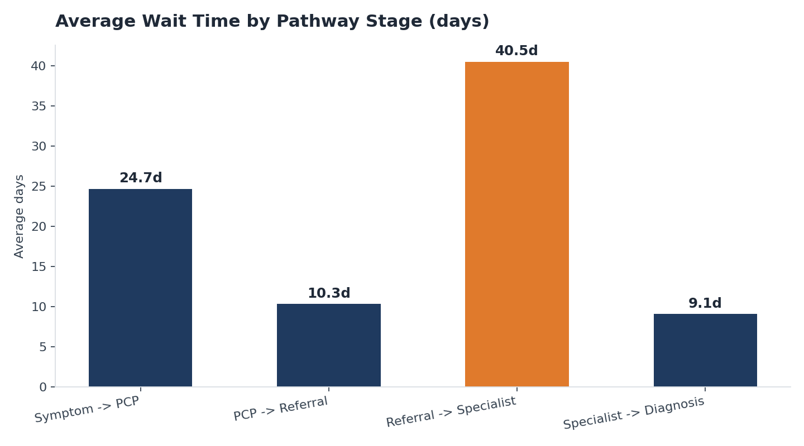
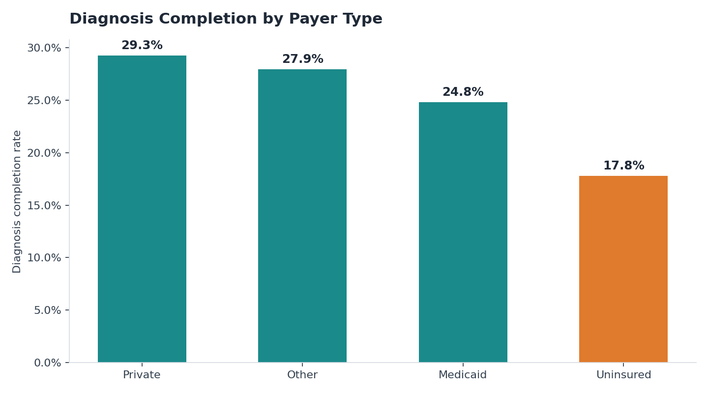
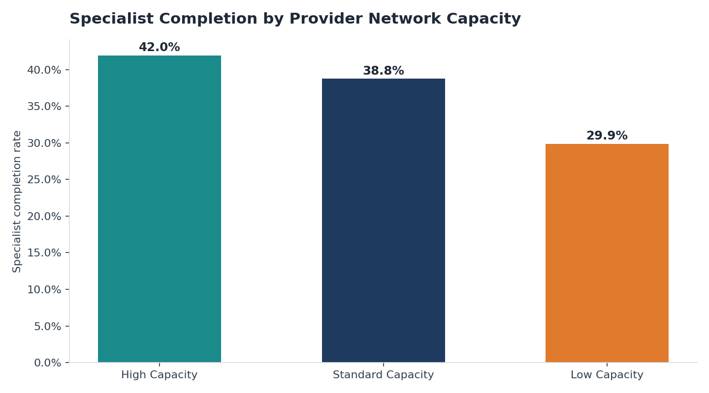

# Pediatric CHD Care Pathway Analytics

[](https://github.com/Udaylakkaraju/pediatric-chd-pathway-analytics/actions/workflows/ci.yml)


**Only 1 in 4 kids with a CHD symptom in this cohort ever reach a diagnosis. This project finds out where the other 3 go missing — and what it would take to get them back.**

A healthcare operations analytics project built in **SQL, Excel, and Python**. I generated a synthetic, EHR-style dataset of 100,000 patients, modeled a 15,000-patient pediatric congenital heart disease (CHD) cohort moving through a five-stage care pathway, and used SQL and Excel to find exactly where the pathway leaks, why, and what fixing it is worth.

No real patient data is used anywhere in this project.

---

## The Pathway, in One Picture

```text
Symptom  ───▶  PCP Visit  ───▶  Referral  ───▶  Specialist  ───▶  Diagnosis
 15,000         13,276           8,581            5,657            3,948
                 (88.5%)         (64.6%)          (65.9%)          (69.8%)
```



Only **26.3%** of patients who show a symptom ever reach a recorded diagnosis. The other 73.7% exit somewhere along the way — and the data shows exactly where.

## The Story in 6 Numbers

| # | Finding | So what |
|---:|---|---|
| 1 | **26.3%** diagnosis completion (3,948 of 15,000) | Most of the cohort never gets resolved |
| 2 | **35.4%** drop-off, PCP → Referral | The single biggest leak in the pathway |
| 3 | **28-day** median wait, Referral → Specialist | The longest bottleneck once patients *are* moving |
| 4 | **42.0% vs. 29.9%** specialist completion, high- vs. low-capacity networks | A 12-point gap driven purely by network capacity |
| 5 | **29.3% vs. 17.8%** diagnosis rate, private vs. uninsured patients | Access barriers compound on top of clinical ones |
| 6 | **~610 additional diagnoses** modeled from two targeted +5pt conversion fixes | The gap is fixable, and the fix is quantifiable |

## Where Patients Fall Out — and Why

<table>
<tr>
<td></td>
<td></td>
</tr>
<tr>
<td></td>
<td></td>
</tr>
</table>

The two biggest losses — **PCP → Referral (35.4%)** and **Referral → Specialist (34.1%)** — are back to back, and the second one also carries the longest wait (28 median days). That combination is why the top two recommendations below both target that middle stretch of the pathway. Payer type and network capacity then stack an access gap on top of the operational one: uninsured patients complete diagnosis at little more than half the rate of privately insured patients, and low-capacity networks lag high-capacity ones by 12 points on specialist completion.

## What I'd Actually Do About It

Translated into five owned, timed, measurable operating rules — not just observations:

| Priority | Queue | Problem | Target | Modeled outcome |
|---|---:|---|---|---:|
| 1 | 4,695 unresolved referral decisions | 35.4% PCP→referral drop-off | Cut to 30.0% | **+328 diagnoses** |
| 2 | 2,924 open referrals | 34.1% referral→specialist drop-off, 28-day wait | Cut to 28.0%, wait to 25 days | **+364 diagnoses**, 16,971 patient-days earlier access |
| 3 | 2,032 missed appointments | No-shows, cancellations, unreachable | Recover 10% | **+142 diagnoses** |
| 4 | 1,709 unclosed specialist visits | 30.2% specialist→diagnosis drop-off | Cut to 25.0% | **+295 diagnoses** |
| 5 | 2,533 high-friction referrals | 86.6% of open queue carries an access flag | Resolve 10% | **+177 diagnoses** |

Every number above ties back to an SLA, an owner, and a measurement plan — full detail in [`docs/KEY_RECOMMENDATIONS.md`](docs/KEY_RECOMMENDATIONS.md). These are standalone planning estimates (populations overlap), not a sum, and they're framed as workload/timing effects, not a dollar ROI claim — the dataset doesn't contain cost or reimbursement data to support one.

## The Deliverable: An Interactive Excel Workbook

The full analysis lives in an interactive Excel workbook, not just static tables. A recruiter can open it and filter the entire pathway by payer, 